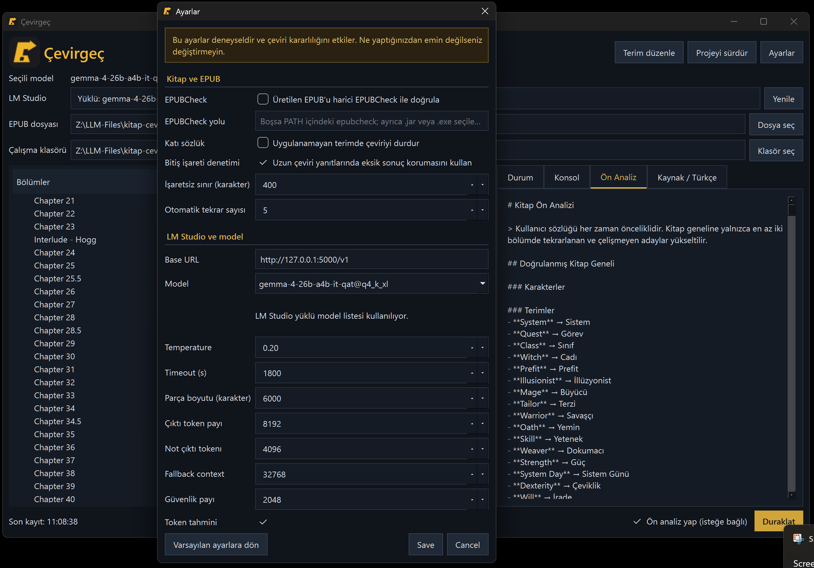

# Çevirgeç



Çevirgeç, DRM içermeyen EPUB kitaplarını yerel bir LM Studio modeliyle İngilizceden Türkçeye çevirmek için geliştirilmiş Windows masaüstü uygulaması ve komut satırı aracıdır. Kaynak EPUB'u çalışma projesine dönüştürür, çeviriyi güvenli kontrol noktalarıyla yürütür ve görselleri ile temel metadata alanlarını koruyan yeni bir EPUB üretir.

> **English:** Çevirgeç is a Turkish-only Windows GUI and CLI application for translating DRM-free EPUB books with a local model served by LM Studio. It supports resumable checkpoints, optional book analysis, terminology enforcement, and EPUB reconstruction.

> [!IMPORTANT]
> Uygulamayı yalnızca çevirme ve dönüştürme hakkına sahip olduğunuz, DRM içermeyen dosyalarda kullanın. Model çıktısı yayımlanmadan önce mutlaka insan tarafından gözden geçirilmelidir.

## Başlıca özellikler

- PySide6 ile hazırlanmış Türkçe masaüstü arayüzü
- Aynı çeviri çekirdeğini kullanan GUI ve CLI çalışma biçimleri
- LM Studio'da yüklü modelleri algılama ve açılır listeden model seçme
- Kaynak EPUB'un içindekiler yapısına göre bölüm içe aktarma
- Görselleri, kapak varlığını ve temel EPUB metadata bilgilerini koruma
- Kitaba özel, zorunlu karşılıklar içeren özel terim sözlüğü
- Kullanıcının dahil edilecek bölümleri seçtiği isteğe bağlı ön analiz
- Kitap geneli sabit bilgiler ile bölüm özelindeki bilgileri ayrı tutma
- Parça bazlı çeviri, atomik kontrol noktaları ve yarıda kalan projeyi sürdürme
- Geçici model/API hatalarında aynı parçayı en fazla iki kez otomatik yeniden deneme
- Gerçek zamanlı durum, konsol, token kullanımı ve dosyaya yazılan kayıtlar
- Güvenli duraklatma: mevcut API isteği ve kayıt işlemi bittikten sonra bekleme
- Güvenli kapanış: devam eden istek tamamlanmadan uygulamayı zorla kapatmama
- Yaklaşık token/context denetimi ve ayarlanabilir güvenlik payı
- Kitabın yaklaşık %25, %50 ve %75 noktalarında olay özeti sıkıştırma
- Windows için PyInstaller ile tek `.exe` oluşturma komut dosyası

## Gereksinimler

- Windows 10 veya 11
- Python 3.10 veya daha yeni bir Python 3 sürümü
- [LM Studio](https://lmstudio.ai/) ve LM Studio'da yüklü bir sohbet modeli
- Geliştirme/GUI çalıştırma için `PySide6`
- `.exe` üretmek için `PyInstaller`

Bağımlılıkları kurmak için proje klasöründe:

```bat
py -3 -m pip install -r requirements.txt
```

## Hızlı başlangıç

1. LM Studio'yu açın ve kullanmak istediğiniz modeli yükleyin.
2. LM Studio içindeki yerel sunucuyu başlatın. Varsayılan adres `http://127.0.0.1:1234/v1` olmalıdır.
3. `GUI_BASLAT.cmd` dosyasını çalıştırın.
4. **EPUB dosyası** alanından kaynak kitabı seçin.
5. **Çalışma klasörü** alanından projenin oluşturulacağı ana klasörü seçin.
6. Gerekirse **Yenile** ile LM Studio model listesini güncelleyin.
7. **Çeviriyi Başlat** düğmesine basın.
8. Açılan özel terim sözlüğünü doldurun veya boş bırakıp devam edin.
9. Ön analiz işaretliyse analiz edilecek bölümleri seçin.

Uygulama ana çalışma klasörünün altında `<KitapAdı>-ceviri` isimli bir proje klasörü oluşturur. Aynı isim kullanımdaysa güvenli bir numaralı ad seçilir.

## LM Studio bağlantısı ve model seçimi

Çevirgeç, LM Studio'nun yerel API'sine bağlanır:

- Model keşfi için önce `/api/v1/models`, gerektiğinde `/api/v0/models`
- Çeviri ve analiz istekleri için `/api/v1/chat`

Tek model yüklüyse uygulama onu otomatik seçer. Birden fazla model yüklüyse **Seçili model** açılır listesinden seçim yapılabilir. Ayarlardaki model alanı serbest metin değildir; LM Studio'dan gelen yüklü model listesi kullanılır.

Varsayılan bağlantı yalnızca yerel makineye yöneliktir. Base URL doğrulaması `localhost`, `127.0.0.1` veya `::1` dışındaki sunucuları kabul etmez. LM Studio anahtar gerektirecek şekilde yapılandırıldıysa `LM_STUDIO_API_KEY` ortam değişkeni kullanılabilir.

## Arayüz

### Üst alan

- **Seçili model:** Çeviride kullanılacak yüklü LM Studio modeli
- **LM Studio:** Model adı ve algılanabilirse gerçek context uzunluğu
- **Yenile:** Model listesini ve sunucu durumunu yeniden sorgular
- **EPUB dosyası:** Yeni proje için kaynak EPUB
- **Çalışma klasörü:** Proje klasörünün oluşturulacağı yer
- **Projeyi sürdür:** Daha önce oluşturulmuş ve kontrol noktaları bulunan bir çalışma klasörünü açar
- **Ayarlar:** Sağ üstteki düğmeden gelişmiş çalışma ayarlarını açar

### Sol bölüm listesi

EPUB içindekiler sırasını ve her bölümün durumunu gösterir. Bir bölüme tıklanınca kaynak metin ve varsa Türkçe çeviri önizlenir. Bu alan yeniden çeviri editörü değildir; proje durumunu izleme ve sonuçları kontrol etme amaçlıdır.

Başlıca durumlar:

- **Bekliyor:** Henüz başlanmadı
- **Sıradaki:** İşlem sırasındaki ilk tamamlanmamış bölüm
- **Ön analiz:** Bölüm analiz ediliyor
- **Çevriliyor:** Bölümün parçaları çevriliyor
- **Tamamlandı:** Bölümün çevirisi ve notları kaydedildi

### Sağ sekmeler

- **Durum:** Aktif bölüm, parça sayısı ve genel ilerleme
- **Konsol:** API istekleri, token bilgileri, yeniden denemeler, uyarılar ve hatalar
- **Ön Analiz:** Tamamlanan ön analiz sonuçları
- **Kaynak / Türkçe:** Seçilen bölümün iki metnini yan yana gösterir

Konsol kayıtları aynı zamanda proje içindeki `translation.log` dosyasına yazılır.

## Özel Terim Sözlüğü

Her kitap için İngilizce terim ile zorunlu Türkçe karşılığı eşleştirilebilir:

| İngilizce terim | Zorunlu karşılık |
|---|---|
| `Murderbot` | `Katilbot` |
| `SecUnit` | `GüvBirim` |

Sözlük isteğe bağlıdır; hiç terim girilmeden devam edilebilir. Girilen terimler `glossary.json` içinde kitap bazında saklanır ve her çeviri isteğine sabit kural olarak eklenir. Bir zorunlu karşılık çıktıda kullanılmazsa uygulama düzeltme ister; geçersiz sonuç kontrol noktası olarak kaydedilmez.

## İsteğe bağlı ön analiz

**Ön analiz yap** seçeneği, çeviriden önce seçilen bölümleri modele inceletir. Bu işlem zorunlu değildir ve toplam süreyi iki kata kadar uzatabilir.

Seçim penceresinde yalnızca hikâyeye ait bölümlerin işaretlenmesi önerilir. Kapak, başlık sayfası, telif, yazar tanıtımı, bülten ve benzeri yardımcı içeriklerin seçilmesi analize gürültü katabilir.

Analiz bilgileri iki katmana ayrılır:

- **Kitap geneli sabit bilgiler:** Tekrarlanan ve çelişmeyen karakter, terim ve anlatım kararları
- **Bölüm özelindeki bilgiler:** Yalnızca ilgili bölüm çevrilirken kullanılan yerel ipuçları

Tam olay özeti doğrudan her çeviri isteğine eklenmez. Böylece modelin sonraki bölüme önceki bölümün tüm metnini taşıması veya bölüm özelindeki bir üslubu bütün kitaba yanlışlıkla yayması önlenir. Kitap geneline taşınacak bir kararın birden fazla bölümde tutarlı biçimde doğrulanması gerekir.

Analiz çıktıları `BOOK-ANALYSIS.md` ve `_python_analysis` altında saklanır. Yapısal olarak geçersiz bir analiz yanıtı en fazla iki kez yeniden denenir; üç deneme de başarısızsa sonuç kaydedilmez ve kullanıcıya hata gösterilir.

## Çeviri, kontrol noktaları ve yeniden deneme

Her bölüm karakter sayısına göre parçalara ayrılır. Bir parça başarıyla çevrildiğinde atomik olarak kaydedilir; program kapanırsa sonraki çalıştırmada tamamlanan parçalar yeniden üretilmez.

Aşağıdaki geçici sorunlarda aynı parça otomatik olarak en fazla iki kez daha denenir; toplam deneme sayısı üçtür:

- Eksik tamamlanma işareti
- Boş veya biçimsel olarak geçersiz model yanıtı
- Yanıta karışan araç/düşünme metni
- Zorunlu sözlük karşılığının kullanılmaması
- Geçici bağlantı ve timeout sorunları
- HTTP 408, 429 veya 5xx yanıtları

Context yetersizliği, çıktı token sınırı, geçersiz ayar, kaynak dosyanın değişmesi, prompt/sözlük uyuşmazlığı gibi kullanıcı müdahalesi isteyen hatalar otomatik yeniden denenmez.

**Duraklat** düğmesi aktif isteği kesmez. İstek tamamlanır, geçerli sonuç kaydedilir ve uygulama bir sonraki parçaya geçmeden bekler. Aynı düğme daha sonra **Devam Et** olur. Pencere kapatılırsa da devam eden API isteğinin ve kayıt işleminin tamamlanması beklenir.

## Bağlam ve özet yönetimi

Çevirgeç modelin context sınırını mümkünse LM Studio'daki yüklü model bilgisinden alır. Bu bilgi okunamazsa ayarlardaki **Fallback context** değeri kullanılır ve konsolda uyarı gösterilir.

Token tahmini açıkken yaklaşık giriş miktarı `karakter / 3` yöntemiyle hesaplanır. Kontrol şu bütçeyi dikkate alır:

```text
tahmini giriş + çıktı token payı + güvenlik payı <= context uzunluğu
```

Güvenlik payı; tokenizer farkları, sistem promptu, sözlük, notlar ve API'nin eklediği görünmeyen mesajlar için boş alan bırakır. Tahmin kesin token sayımı değildir, taşma riskini erken fark etmek için koruyucu bir kontroldür.

Kitabın yaklaşık %25, %50 ve %75 noktalarında geçmiş olay/bağlam notları sıkıştırılır. Sözlük, kişi adları, hitap biçimleri ve kalıcı üslup kararları bu sıkıştırmayla değiştirilmez.

## Ayarlar

Ayarlar gelişmiş/deneysel seçeneklerdir. Emin değilseniz varsayılan değerleri koruyun; **Varsayılan ayarlara dön** düğmesiyle güvenli başlangıç ayarları geri yüklenebilir.

| Ayar | İşlevi |
|---|---|
| Base URL | LM Studio yerel API adresi |
| Model | LM Studio'da yüklü modeller arasından seçim |
| Temperature | Modelin üretim çeşitliliği; istekle LM Studio'ya gönderilir |
| Timeout | Tek API isteği için beklenecek azami saniye |
| Parça boyutu | Kaynak metnin yaklaşık karakter tabanlı parça büyüklüğü |
| Çıktı token payı | Çeviri yanıtına ayrılan azami token bütçesi |
| Not çıktı tokenı | Analiz/not yanıtına ayrılan token bütçesi |
| Fallback context | LM Studio context bilgisi vermezse kullanılacak sınır |
| Güvenlik payı | Context hesabında boş bırakılan koruyucu token alanı |
| Token tahmini | Yaklaşık context ön kontrolünü açar veya kapatır |

Parça boyutu veya ilgili çalışma ayarları çeviri sırasında değiştirilirse mevcut bölüm eski ayarlarla tamamlanır; yeni değerler sonraki bölümde devreye girer. Bu davranış kontrol noktalarının tutarlılığını korur.

## EPUB içe aktarma ve çıktı

Kaynak EPUB değiştirilmez. İçe aktarma sırasında HTML/XHTML içerikleri çalışma metnine dönüştürülür ve EPUB içindeki görsellere kaynak referansları korunur.

Üretilen EPUB için:

- Kaynak metadata alanları mümkün olduğu ölçüde kopyalanır
- Dil `tr` olarak ayarlanır
- Başlık metadata'sının sonuna `TR` eklenir
- ISBN kaynakta varsa korunur; yoksa yapay ISBN üretilmez
- Yayıncı, tarih, yazar ve diğer mevcut metadata bilgileri korunur
- Kaynak görseller ve ikili varlıklar çıktı paketine eklenir
- Yapay ikinci kapak oluşturulmaz
- EPUB 3 navigation ve EPUB 2 NCX içindekiler yapıları üretilir
- Çevrilmiş dosyadaki ilk `#` başlığı ilgili bölümün içindekiler adı olarak kullanılır
- İçe aktarıcının teknik amaçla eklediği ilk başlık sayfa gövdesinde gizlenir

Çıktı adı `<Orijinal Dosya Adı> TR.epub` biçimindedir. Aynı ad varsa `TR-2`, `TR-3` şeklinde artırılır.

## Proje klasörü

Tipik bir çalışma klasörü şu dosyaları içerir:

```text
Kitap-ceviri/
├── source/                    # İçe aktarılan kaynak bölümler
├── translation/               # Okunabilir Türkçe bölüm dosyaları
├── _python_translation/       # Parça kontrol noktaları ve çalışma durumu
├── _python_analysis/          # Ön analiz seçimleri ve kontrol noktaları
├── 00-CONTEXT.md              # Bölüm durumu ve süreklilik notları
├── BOOK-ANALYSIS.md           # Okunabilir ön analiz sonucu
├── glossary.json              # Kitaba özel terimler
├── translation.log            # Konsol kayıtları
└── TAM-CEVIRI.md              # Birleştirilmiş çeviri metni
```

Çıktı EPUB da bu çalışma alanında oluşturulur. `_python_translation` ve `_python_analysis` klasörlerini silmek, devam ettirme bilgisini kaybettirebilir.

## Komut satırı kullanımı

`BASLAT.cmd`, argümansız CLI başlangıcıdır. Doğrudan komut vermek için:

```bat
py -3 cevir.py --epub "D:\Kitaplar\kitap.epub"
py -3 cevir.py --book "D:\Kitaplar\kitap-ceviri"
py -3 cevir.py --file "004-Begin-Reading.md" --book "D:\Kitaplar\kitap-ceviri"
py -3 cevir.py --check --book "D:\Kitaplar\kitap-ceviri"
```

| Seçenek | Açıklama |
|---|---|
| `--epub DOSYA` | Bir EPUB'u içe aktarır ve oluşan projeyi çevirir |
| `--book KLASÖR` | Mevcut projeyi sürdürür |
| `--file DOSYA` | Projedeki tek kaynak bölümünü işler |
| `--check` | LM Studio/model bağlantısını kontrol eder |
| `--analyze` | Çeviriden önce ön analiz çalıştırır |
| `--analyze-file DOSYA` | Analize dahil edilecek dosyayı belirtir; tekrar kullanılabilir |

Örnek seçili analiz:

```bat
py -3 cevir.py --book "D:\Kitaplar\kitap-ceviri" --analyze ^
  --analyze-file "004-Begin-Reading.md" ^
  --analyze-file "005-Chapter-Two.md"
```

## Windows `.exe` oluşturma

1. Proje klasöründe `BUILD.cmd` dosyasını çalıştırın.
2. Komut dosyası bağımlılıkları kurar ve PyInstaller'ı tek dosya/pencereli modda çalıştırır.
3. Sonuçlar `dist` klasörüne yazılır:

```text
dist/
├── Cevirgec.exe
├── config.json
└── translation_prompt.txt
```

Antivirüslerin yeni ve imzasız PyInstaller dosyalarında yanlış pozitif üretmesi mümkündür.

## Kaynak dosyaların görevleri

| Dosya | Görevi |
|---|---|
| `gui.py` | PySide6 arayüzü, diyaloglar ve kullanıcı etkileşimi |
| `app_core.py` | Ortak çeviri motoru, LM Studio istemcisi, checkpoint ve analiz mantığı |
| `cevir.py` | Komut satırı giriş noktası |
| `epub_import.py` | EPUB içe aktarma ve çalışma projesi oluşturma |
| `epub_output.py` | Çevrilmiş EPUB'u yeniden paketleme |
| `translation_prompt.txt` | Ana çeviri talimatı |
| `config.json` | Çalışma ayarları |
| `GUI_BASLAT.cmd` | Python ile GUI'yi başlatma |
| `BASLAT.cmd` | Python ile CLI'yi başlatma |
| `BUILD.cmd` | Windows `.exe` oluşturma |
| `tests/` | Otomatik testler |

## Testler

Proje kökünde:

```bat
py -3 -m unittest discover -s tests -v
```

Testler LM Studio'da gerçek bir kitabın tamamını çevirmek yerine ayrıştırma, kontrol noktası, yeniden deneme ve EPUB üretiminin programatik davranışlarını denetler. Gerçek model kalitesi seçilen modele, quantization düzeyine, context ayarına ve kaynak metne bağlıdır.

## Gizlilik ve güvenlik

- Çevirgeç kitap metnini yapılandırılmış yerel LM Studio adresine gönderir.
- Uygulama kendi başına bir bulut çeviri hizmetine bağlanmaz.
- Base URL yerel adreslerle sınırlandırılmıştır.
- API isteklerinde sistem proxy'si kullanılmaz.
- Kaynak EPUB değiştirilmez.
- `config.json` içinde parola veya GitHub anahtarı saklamayın.
- Bir hata kaydı paylaşmadan önce kişisel klasör yollarını ve kitap adlarını kontrol edin.

## Sınırlamalar

- DRM korumalı EPUB dosyaları desteklenmez.
- Taranmış sayfalardan OCR yapılmaz.
- Çok karmaşık tablolar, etkileşimli öğeler ve özel JavaScript davranışları sadeleşebilir.
- Yerel model tutarlı terim ve üslup kararlarına rağmen hata veya uydurma üretebilir. Çoğu modelin Türkçe çevirisi iyi değil, kısa metinlerde deneyip kendinize uygun olanı bulun.
- Zorla işlem sonlandırılırsa yalnızca son tamamlanmış kontrol noktasına kadar olan çalışma korunur.
- Son EPUB'un Calibre ve en az bir farklı okuyucuda kontrol edilmesi önerilir.

## Bilinen sorunlar
- Çeviriden sonra oluşan Epub dosyasında ekstra kapak,content başlığı üretiyor.
- Model kaynaklı, Eksik tamamlanma işareti,boş veya biçimsel olarak geçersiz model yanıtı,yanıta karışan araç/düşünme metni.Buna workaround olarak olarak o bölüm tekrar deneniyor iki defa.
- Çalışırken durdurup, LM studioda başka bir model yükleyip bunu gösterirseniz çalışmıyor, eski modeli ayağı kaldırıp ondan devam ediyor. Programı kapayıp açmadan düzelmiyor.

## Sorun giderme

| Belirti | Kontrol edilecekler |
|---|---|
| Model görünmüyor | LM Studio sunucusunun açık ve modelin gerçekten yüklü olduğunu doğrulayın; **Yenile**'ye basın |
| Bağlantı reddedildi | Base URL'yi ve LM Studio portunu kontrol edin |
| Context yetersiz | Parça boyutunu veya çıktı token payını azaltın; doğru yüklü modelin seçildiğini doğrulayın |
| Yanıt tamamlanmadı | Otomatik denemeleri bekleyin; sürerse çıktı token payını artırın veya parçayı küçültün |
| Ön analiz JSON hatası | İki otomatik yeniden deneme yapılır; sürerse modeli/temperature değerini kontrol edin |
| Sözlük karşılığı eksik | Terimin yazımını kontrol edin; model üç denemede de uygulayamıyorsa daha güçlü model deneyin |
| Proje uyuşmazlığı | Kaynak, prompt, sözlük veya checkpoint dosyalarını çalışma sırasında elle değiştirmeyin |
| Görseller eski projede bozuk | Eski içe aktarma biçimindeki proje yerine kaynak EPUB'dan yeni proje oluşturun |
| DRM/şifreleme hatası | DRM'siz ve kullanma hakkına sahip olduğunuz bir EPUB kullanın |

Daha ayrıntılı kullanım notları için [KULLANIM.md](KULLANIM.md) dosyasına bakın.
